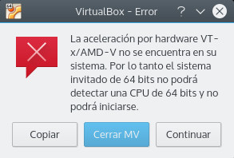
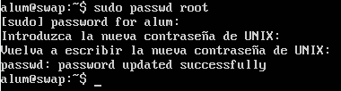
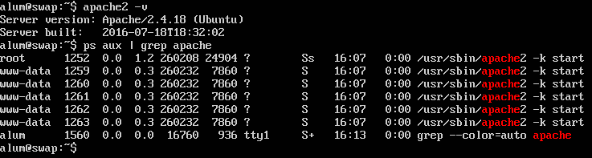
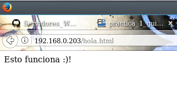

# Práctica 1
### Marta Gómez y Braulio Vargas

## Configuración de VirtualBox
Al configurar la máquina virtual de _VirtualBox_ hemos tenido los siguientes problemas.

### VERR_VM_DRIVER_NOT_INSTALLED (rc=-1908)

### Aceleración hardware desactivada

Una vez resuelto el problema anterior, pudimos arrancar la máquina virtual pero nos apareció el siguiente aviso:



Para resolver esto, es necesario acceder a la BIOS de la máquina anfitriona y activar la opción correspondiente.

## Instalación de Ubuntu Server

Para instalar _Ubuntu Server_ hemos seguido las indicaciones del guión de prácticas.

### Establecer contraseña para root
Una vez instalado, hemos establecido una contraseña para el usuario `root`.



### Comprobar instalación de apache 
Tras esto, comprobamos que se ha instalado correctamente el servidor Apache.



Y, para hacer una última comprobación de que nuestro servidor está operativo creamos el siguiente fichero, que se llamará `hola.html`:

```html
<html>
    <body>
        <p>Esto funciona :)!</p>
    </body>
</html>
```

y accedemos a él desde el __navegador de la máquina anfitriona__.


