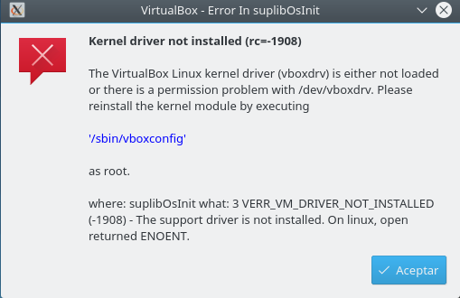
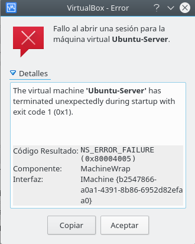
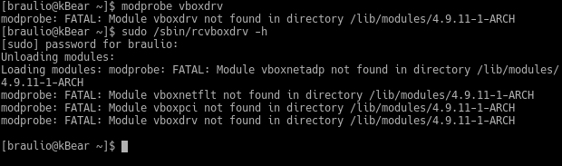
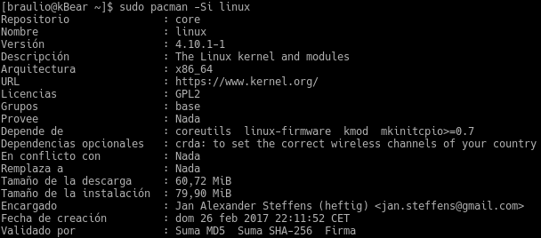
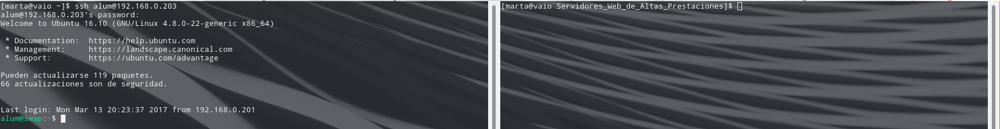

# Práctica 1
### Marta Gómez y Braulio Vargas

## Configuración de VirtualBox
Al configurar la máquina virtual de _VirtualBox_ hemos tenido los siguientes problemas.

### VERR_VM_DRIVER_NOT_INSTALLED (rc=-1908)

La instalación de VirtualBox en ArchLinux puede causar problemas, dándose al iniciar la máquina virtual como se ven la siguiente imagen. 



Además de este error, nos saldrá otro refiriéndose a que falta un módulo del kernel por instalar, por lo que no es posible ejecutar la máquina virtual.



Para comprobar qué modulos del kernel nos faltan por instalar, podemos ejecutar las siguientes órdenes en nuestro terminal `modprobe vboxdrv` o bien, `sudo /sbin/rcvboxdrv -h`. El resultad de ambas los podemos ver a continuación:



Como podemos observar, faltan por instalar los módulos del kernel:
* __vboxdrv__
* __vboxnetflt__
* __vboxpci__
* __vboxnetadp__

Para solucionar esto y poder instalar los módulos, vamos a ejecutar las siguientes órdenes en nuestro terminal, para actualizar el kernel e instalar todo lo necesario.

1. Actualizar el kernel de nuestro ArchLinux y las cabeceras del kernel: 

    ```
    sudo pacman -Si linux
    ```

  

  Con esta orden podemos ver la versión del kernel de nuestro sistema, y otro tipo de información útil. Principalmente lo usaremos para ver si estamos en la última versión o no. 

2. Actualizar las cabeceras del kernel:

  ```
  sudo pacman -S linux-headers
  ```

3. Instalar VirtualBox

  ```
  sudo pacman -S virtualbox virtualbox-guest-iso
  ```

4. Activar los módulos del kernel para VirtualBox

  ```
  sudo modprobe -a vboxdrv vboxnetflt vboxpci vboxnetadp
  ```

5. Hacemos que VirtualBox recargue los módulos.

  ```
  sudo /sbin/rcvboxdrv -h
  ```

6. Una vez hecho esto, añadimos nuestro usuario a los usuarios de VirtualBox

  ```
  sudo gpasswd -a $USER vboxusers
  ```

7. Por último, para no tener que estar recargando los módulos manualmente, podemos incluir un pequeño archivo para que cargue los módulos de VirtualBox al arrancar la máquina:

  ```
  sudo nano /etc/modules-load.d/virtualbox.conf

  # Modules
  vboxdrv
  vboxnetadp
  vboxnetflt
  vboxpci
  ```

### Aceleración hardware desactivada

Una vez resuelto el problema anterior, pudimos arrancar la máquina virtual pero nos apareció el siguiente aviso:


Para resolver esto, es necesario acceder a la BIOS de la máquina anfitriona y activar la opción correspondiente.

### Configuración de Red
Para poder establecer comunicación entre la máquina anfitriona y la máquina virtual, se ha tenido que configurar VirtualBox. Para ello, se ha tenido que añadir un __adaptador puente__ de red a la configuración de la máquina virtual, quedándonos una máquina virtual con un adaptador _NAT_ y otro _Puente_. 

Además, se ha modificado el achivo `/etc/network/interfaces` añadiendo las siguientes líneas:

```
auto enp0s8
iface enp0s8 inet dhcp
```

`enp0s8` es el nombre del adaptador de red puente (se puede ver haciendo `ifconfig -a`).


## Instalación de Ubuntu Server

Para instalar _Ubuntu Server_ hemos seguido las indicaciones del guión de prácticas.

### Establecer contraseña para root
Una vez instalado, hemos establecido una contraseña para el usuario `root`.


### Comprobar instalación de apache 
Tras esto, comprobamos que se ha instalado correctamente el servidor Apache.


Y, para hacer una última comprobación de que nuestro servidor está operativo creamos el siguiente fichero, que se llamará `prueba.html`:

```html
<html>
    <body>
        <p>Esto funciona :)!</p>
    </body>
</html>
```

y accedemos a él desde el __navegador de la máquina anfitriona__.


### Comprobación del servidor SSH
Para comprobar la instalación del servidor SSH, se ha probado a hacer un acceso desde la máquina anfitriona.


