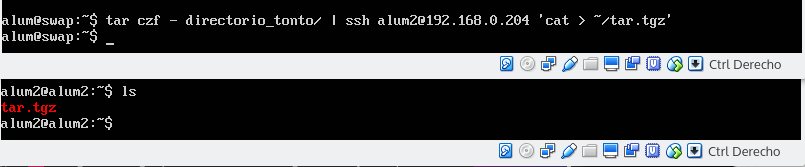
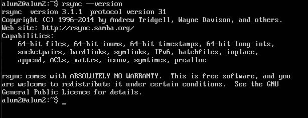
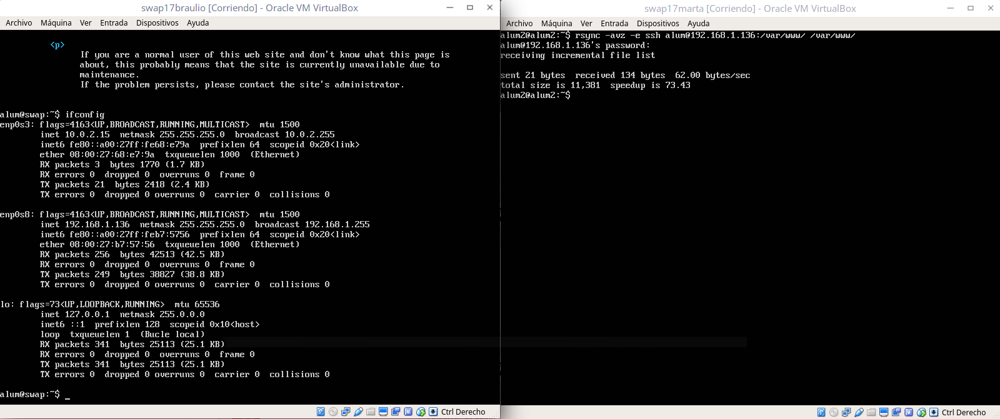
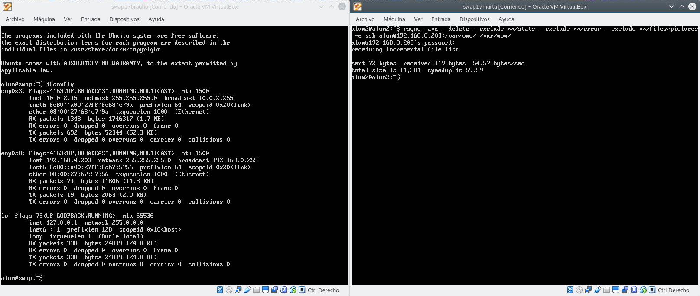
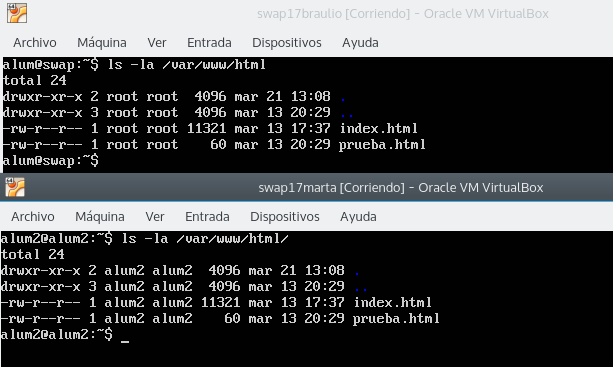
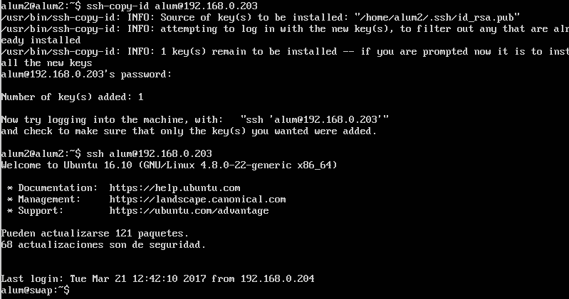
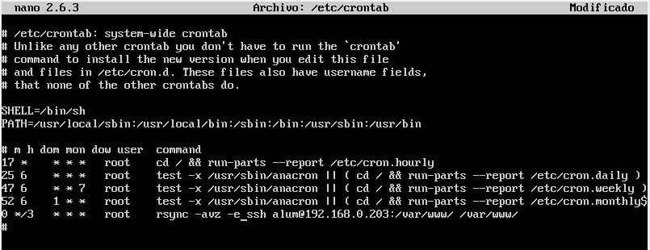

# Práctica 2: Clonar la información de un sitio web
### Marta Gómez y Braulio Vargas

## Copiando archivos por SSH
Para copiar archivos entre un servidor y otro podemos usar SSH de la siguiente forma:

```bash
$ tar czf - directorio_tonto/ | ssh alum2@192.168.0.204 'cat > ~/tar.tgz'
```

Así, comprimiremos el contenido del directorio `directorio_tonto` y enviaremos el archivo comprimido a nuestro segundo servidor. Ahora bien, esto puede resultar algo rudimentario por lo que es mejor usar alternativas como `rsync`



## Instalar la herramienta `rsync`

Para instalar la herramienta, tenemos que ejecutar la orden en nuestra máquina:

```bash

$ sudo apt install rsync
```

Una vez instalada la herramienta `rsync`, podemos hacer una comprobación rápida de que se ha instalado correctamente comprobando la versión de rsync, como se ve en la siguiente imagen:



Una vez comprobado que se ha instalado correctamente, para poder copiar el directorio _/var/www/_ de la máquina principal a la máquina secundaria, tenemos que ejecutar el siguiente comando en nuestra **máquina secundaria**:

```bash
$ rsync -avz -e ssh alum@192.168.1.136:/var/www/ /var/www/
```

Con esto, `rsync` realizará una copia del directorio de la máquina principal a la máquina secundaria por medio de `ssh`. Esto se especifica usando el parámetro `-e` y la dirección IP de la máquina principal. En la siguiente imagen podemos ver el resultado:



Si quisiéramos excluir ciertos directorios de nuestra copia de seguridad podemos usar el parámetro `--exclude`. Si queremos que al borrar un archivo en un servidor se borre también en el otro, podemos usar el parámetro `--delete`:

```bash
$ rsync -avz --delete --exclude=**/stats --exclude=**/error --exclude=**/files/pictures -e ssh alum@192.168.0.203:/var/www/ /var/www/
```



Por último, para comprobar que la sincronización ha funcionado, probamos a listar el directorio `/var/www/html` en ambas máquinas:



## Acceder a SSH sin contraseña
Siguiendo los pasos del guión de prácticas hemos configurado la máquina secundaria para acceder a la primera por SSH sin necesidad de contraseña.



## Actualizar el contenido de _/var/www/_ con `crontab`.

Para realizar esta tarea, se ha modificado el fichero que se encuentra en _/etc/crontab_ de la máquina secundaria. Para ello, ejecutamos la siguiente línea en el terminal:

```bash
sudo nano /etc/crontab
```

Una vez dentro, insertamos la siguiente línea en nuestro fichero _crontab_:

```
0 */3 * * * root rsync -avz --exclude=**/stats --exclude=**/error --exclude=**/files/pictures -e ssh alum@192.168.0.203:/var/www/ /var/www/
```

Con el patrón `0 */3 * * *` indicamos que se ejecute la orden en el minuto 0cada tres horas. Existe la página https://crontab.guru/ que nos permite saber si estamos poniendo bien el patrón, y ver cuándo se ejecutará por primera vez instrucción que introduzcamos en el fichero crontab.

En la siguiente imagen podemos ver cómo quedaría el fichero crontab.

