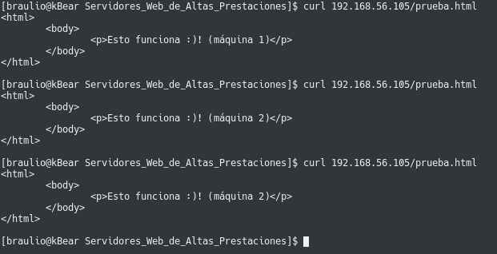
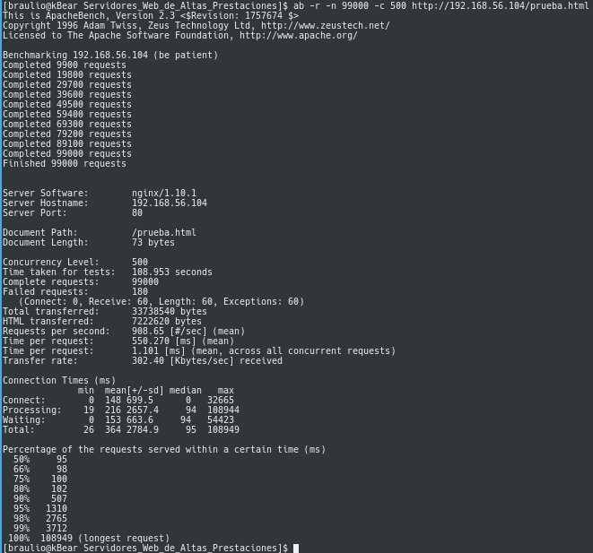

# Práctica 3: Balanceo de Carga

### Marta Gómez y Braulio Vargas

## Configurando un balanceador de carga _Round-Robin_ con nginx

Para instalar `nginx`, ejecutamos la siguiente orden en nuestro terminal:

```bash
$ sudo apt install nginx
```

y lo iniciaremos con:

```bash
# Ejecutar el servicio al arranque
$ sudo systemctl enable nginx
# e iniciar el servicio:
$ sudo systemctl start nginx
```

Una vez instalado e iniciado el servicio, podemos empezar a configurar nuestro balanceador de carga con `nginx`. Para ello, tenemos que modificar el contenido del fichero de configuración, situado en `/etc/nginx/conf.d/default.conf` de la siguiente manera:

```
# IP's de los servidores finales
upstream apaches {
    # Maquina principal
    server 192.168.56.102;
    # Maquina secundaria 
    server 192.168.56.103;
}

# Configuración del servidor 
server{
    # Puerto en el que escuchará
    listen 80;
    server_name balanceador;

    # Archivos de log
    access_log /var/log/nginx/balanceador.access.log;
    error_log /var/log/nginx/balanceador.error.log;
    root /var/www/;
    
    location /
    {
        proxy_pass http://apaches;
        proxy_set_header Host $host;
        proxy_set_header X-Real-IP $remote_addr;
        proxy_set_header X-Forwarded-For $proxy_add_x_forwarded_for;
        proxy_http_version 1.1;
        proxy_set_header Connection "";
    }
}
```

Es posible, que nginx siga funcionando como servidor en vez de como balanceador de carga, ignorando nuestro fichero `default.conf` que hemos creado o modificado. Para ello, tenemos que modificar el fichero `nginx.conf` que se encuentra en la ruta `/etc/nginx/nginx.conf`. En él, tendremos que comentar la siguiente línea:

```
include /etc/nginx/sites-enabled
```

Y reiniciamos el servicio con

```bash
$ sudo systemctl restart nginx
```

## Configurando un balanceador de carga ponderado

Para realizar esto, sabiendo que alguna de las máquinas finales es más potente y puede satisfacer más tráfico que otra, podemos asignarle un peso en el entorno `upstream` del fichero `default.conf` que configura nuestro balanceador. Por defecto, para todas las máquinas, este peso será 1. En nuestro caso, lo hemos probado de la siguiente manera:

```
upstream apaches {
    # Maquina principal
    server 192.168.56.102 weight=3; 
    # Maquina secundaria 
    server 192.168.56.103;
}
```

### Probando el balanceador de carga

Para probar el balanceador de carga, podemos ejecutar desde nuestra máquina anfitrión, la orden:

```bash
curl IP_BALANCEADOR/prueba.html
# En nuestro caso
curl 192.168.43.198/prueba.html
```

Tras esto, deberíamos obtener una salida en nuestro terminal como la que podemos ver a continuación:


### Probando la configuración con ponderación:

Si volvemos a ejecutar la orden ```curl 192.168.43.198/prueba.html```, tendremos la siguiente salida por nuestro terminal:


## Configurando un Balanceador de Carga con haproxy
Para instalar `haproxy` ejecutamos

```bash
$ sudo apt install haproxy
```

Una vez instalado, debemos indicarle las IPs de las dos máquinas servidoras. Para ello, modificamos el fichero `/etc/haproxy/haproxy.cfg` añadiendo a la configuración de `haproxy` lo siguiente:

```
global
    maxconn 256

frontend http-in
    bind *:80
    default_backend servers

backend servers
    server  m1 192.168.0.204 maxconn 32
    server  m2 192.168.0.203 maxconn 32
```

### Probando que el balanceador funciona
Para probar que el balanceador funciona, cambiamos ligeramente la página de prueba de cada una de las máquinas de forma que se pueda diferenciar cuando accedemos a una u a otra.

Después, lanzamos `haproxy` con el siguiente comando:

```bash
$ sudo /usr/sbin/haproxy -f /etc/haproxy/haproxy.cfg
```

Si accedemos con `curl` a la URL del balanceador (`192.168.0.207`) iremos intercalando entre las páginas de prueba de cada servidor:


## Configurando un balanceador de carga con Pound
Para esta parte de la práctica, vamos a seguir [este tutorial](https://www.linuxhelp.com/how-to-configure-load-balancer-with-pound-in-ubuntu/). 

En primer lugar, instalamos `pound` con el siguiente comando:

```bash
$ sudo apt install pound
```

Una vez instalado, pasamos a editar el archivo de configuración `/etc/pound/pound.cfg`. Debemos tener en cuenta que la IP de la máquina que hará de balanceador es `192.168.56.105` y la de los dos servidores finales son `192.168.56.102` y `192.168.56.103`.

```
ListenHTTP
    Address 192.168.56.105
    Port    80
End
Service
    BackEnd
        Address 192.168.56.102
        Port    80
    End
    BackEnd
        Address 192.168.56.103
        Port    80
    End
End
```
Una vez configurado el fichero de configuración, podemos arrancar el servicio de la siguiente manera:

```bash
$ sudo sed -i -e "s/^startup=0/startup=1/" /etc/default/pound 
$ sudo systemctl start pound
```

A continuación, tenemos que editar el fichero `50-default.conf`, alojado en `/etc/rsyslog.d/50-default.conf`, cambiando la línea `*.*;auth,authpriv.none;local1.none` de la siguiente manera, y añadiendo una nueva a continuación:

```
*.*;auth,authpriv.none;local1.none              -/var/log/syslog
local1.*                                        /var/log/pound.log
```

Tras esto, reiniciamos el servicio
```bash
$ sudo systemctl restart rsyslog
```

y comprobamos si el `pound` funciona, realizando peticiones con `curl`:



## Sometiendo la granja web a una carga alta
### Instalando `ab` en la máquina anfitriona
Para poder someter la granja web a una alta carga, hemos instalado _Apache Benchmark_ en nuestra máquina anfitriona (__Arch Linux__):

```bash
$ pacaur -S apache-tools
```

### nginx

Para probar nuestra granja web con un balanceador `nginx` con configuración Round-Robin, vamos a lanzar 99000 peticiones de 500 en 500 con _apache benchmark_ a nuestro balanceador, pidiendo la página `prueba.html`.

```
$ ab -n 99000 -c 500 http://192.168.56.104/prueba.html
```


En este caso, hemos realizado 99000 peticiones al servidor, donde ha tardado 57.294 segundos en hacer el test completo, sin peticiones fallidas.

Por segundo, es capaz de atender 1727.94 peticiones porsegundo, tardando unos 289.361 ms, a una velocidad de transferencia de 577.11 Kbytes/sec.

La petición más lenta ha tardado 57283 ms, mientras qeu las más rápidas han tardado 95ms.

### haproxy
Para poner a prueba nuestro servidor con `haproxy` como balanceador de carga hemos hecho 99000 peticiones haciendo las peticiones de 500 en 500.

```bash
$ ab -n 99000 -c 500 http://192.168.0.207/prueba.html
```


En hacer las 99000 peticiones (de 500 en 500) se ha tardado un minuto. Todas las peticiones se han completado correctamente, lo que quiere decir que nuestro servidor ha sido capaz de responder a todas en un tiempo medianamente razonable. Por segundo se han respondido 1776.81 peticiones y cada una ha sido respondida, en media, en 281.403 ms. La petición más lenta ha tardado 32987 ms en ser respondida mientras que las más rápidas (un 50% de las peticiones), 201 ms.

### Comparación entre los Balanceadores probados

| Balanceador | Tiempo total | Tiempo mínimo | Tiempo máximo | Peticiones fallidas |
|:-----------:|:------------:|:-------------:|:-------------:|:-------------------:|
| nginx       | 57,294 s     | 49 ms         | 57283 ms      | 0                   |
| haproxy     | 55,718 s     | 201 ms        | 32987 ms      | 0                   |

Como se ve en la tabla anterior, tanto _nginx_ como _haproxy_ han sido capaces de soportar la misma carga y en un tiempo bastante parecido (sólo dos segundos de diferencia entre sí). _Nginx_ es más eficiente, pues ha sido capaz de responder el 50% de las peticiones en sólo 49ms mientras que _haproxy_ lo ha hecho en 201ms. Ahora bien, el tiempo máximo de respuesta de _haproxy_  ha sido de 3 segundos mientras que _nginx_ ha necesitado dos segundos más. Por tanto,  podemos decir que la configuración hecha con _haproxy_ es mejor que la que hemos hecho con _nginx_.
