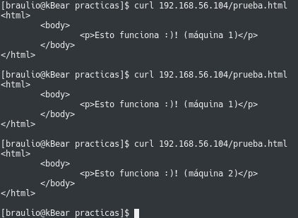
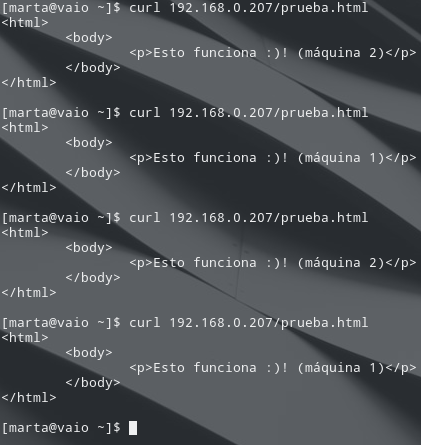
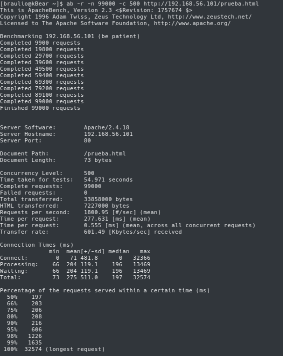

# Práctica 3: Balanceo de Carga

### Marta Gómez y Braulio Vargas

## Configurando un balanceador de carga _Round-Robin_ con nginx

Para instalar `nginx`, ejecutamos la siguiente orden en nuestro terminal:

```bash
$ sudo apt install nginx
```

y lo iniciaremos con:

```bash
# Ejecutar el servicio al arranque
$ sudo systemctl enable nginx
# e iniciar el servicio:
$ sudo systemctl start nginx
```

Una vez instalado e iniciado el servicio, podemos empezar a configurar nuestro balanceador de carga con `nginx`. Para ello, tenemos que modificar el contenido del fichero de configuración, situado en `/etc/nginx/conf.d/default.conf` de la siguiente manera:

```
# IP's de los servidores finales
upstream apaches {
    # Maquina principal
    server 192.168.1.136;
    # Maquina secundaria 
    server 192.168.1.139;
}

# Configuración del servidor 
server{
    # Puerto en el que escuchará
    listen 80;
    server_name balanceador;

    # Archivos de log
    access_log /var/log/nginx/balanceador.access.log;
    error_log /var/log/nginx/balanceador.error.log;
    root /var/www/;
    
    location /
    {
        proxy_pass http://apaches;
        proxy_set_header Host $host;
        proxy_set_header X-Real-IP $remote_addr;
        proxy_set_header X-Forwarded-For $proxy_add_x_forwarded_for;
        proxy_http_version 1.1;
        proxy_set_header Connection "";
    }
}
```

Es posible, que nginx siga funcionando como servidor en vez de como balanceador de carga, ignorando nuestro fichero `default.conf` que hemos creado o modificado. Para ello, tenemos que modificar el fichero `nginx.conf` que se encuentra en la ruta `/etc/nginx/nginx.conf`. En él, tendremos que comentar la siguiente línea:

```
include /etc/nginx/sites-enabled
```

Y reiniciamos el servicio con

```bash
$ sudo systemctl restart nginx
```

## Configurando un balanceador de carga ponderado

Para realizar esto, sabiendo que alguna de las máquinas finales es más potente y puede satisfacer más tráfico que otra, podemos asignarle un peso en el entorno `upstream` del fichero `default.conf` que configura nuestro balanceador. Por defecto, para todas las máquinas, este peso será 1. En nuestro caso, lo hemos probado de la siguiente manera:

```
upstream apaches {
    # Maquina principal
    server 192.168.1.136 weight=3; 
    # Maquina secundaria 
    server 192.168.1.139;
}
```

### Probando el balanceador de carga

Para probar el balanceador de carga, podemos ejecutar desde nuestra máquina anfitrión, la orden:

```bash
curl IP_BALANCEADOR/prueba.html
# En nuestro caso
curl 192.168.43.198/prueba.html
```

Tras esto, deberíamos obtener una salida en nuestro terminal como la que podemos ver a continuación:


### Probando la configuración con ponderación:

Si volvemos a ejecutar la orden ```curl 192.168.43.198/prueba.html```, tendremos la siguiente salida por nuestro terminal:



## Configurando un Balanceador de Carga con haproxy
Para instalar `haproxy` ejecutamos

```bash
$ sudo apt install haproxy
```

Una vez instalado, debemos indicarle las IPs de las dos máquinas servidoras. Para ello, modificamos el fichero `/etc/haproxy/haproxy.cfg` añadiendo a la configuración de `haproxy` lo siguiente:

```
global
    maxconn 256

frontend http-in
    bind *:80
    default_backend servers

backend servers
    server  m1 192.168.0.204 maxconn 32
    server  m2 192.168.0.203 maxconn 32
```

### Probando que el balanceador funciona
Para probar que el balanceador funciona, cambiamos ligeramente la página de prueba de cada una de las máquinas de forma que se pueda diferenciar cuando accedemos a una u a otra.

Después, lanzamos `haproxy` con el siguiente comando:

```bash
$ sudo /usr/sbin/haproxy -f /etc/haproxy/haproxy.cfg
```

Si accedemos desde nuestro navegador a la URL del balanceador (`192.168.0.207`) iremos intercalando entre las páginas de prueba de cada servidor:



## Configurando un balanceador de carga con Pound
Para esta parte de la práctica, vamos a seguir [este tutorial](http://www.tecmint.com/setting-up-pound-web-server-load-balancing-in-linux/). 

En primer lugar, instalamos `pound` con el siguiente comando:

```bash
$ sudo apt install pound
```

Una vez instalado, pasamos a editar el archivo de configuración `/etc/pound/pound.cfg`. Debemos tener en cuenta que la IP de la máquina que hará de balanceador es `192.168.0.212` y la de los dos servidores finales son `192.168.0.203` y `192.168.0.204`.

```
ListenHTTP
    Address 192.168.0.212
    Port    80
    Service
        BackEnd
            Address 192.168.0.204
            Port    80
        End
    End
    Service
        BackEnd
            Address 192.168.0.203
            Port    80
        End
    End
End
```

Por último, debemos arrancar el servicio

```bash
$ sudo /etc/init.d/pound restart

```

Si todo ha salido bien, veremos este mensaje:


## Sometiendo la granja web a una carga alta
### Instalando `ab` en la máquina anfitriona
Para poder someter la granja web a una alta carga, hemos instalado _Apache Benchmark_ en nuestra máquina anfitriona (__Arch Linux__):

```bash
$ pacaur -S apache-tools
```

### haproxy
Para poner a prueba nuestro servidor con `haproxy` como balanceador de carga hemos hecho 100000 peticiones haciendo las peticiones de 500 en 500

```bash
$ ab -n 100000 -c 500 http://192.168.0.207/prueba.html
```



En hacer las 100000 peticiones (de 500 en 500) se ha tardado un minuto. Todas las peticiones se han completado correctamente, lo que quiere decir que nuestro servidor ha sido capaz de responder a todas en un tiempo medianamente razonable. Por segundo se han respondido unas 1500 peticiones y cada una ha sido respondida, en media, en unos 340 ms. La petición más lenta ha tardado 16030 ms en ser respondida mientras que las más rápidas (un 50% de las peticiones), 243 ms.
