# Práctica 4: Asegurar la granja web

## Instalar un certificado SSL autofirmado para configurar el acceso por HTTPS

Para generar nuestro certificado SSL, ejecutaremos el comando `a2enmod ssl` y pasarán a activarse una serie de módulos en nuestra máquina. Una vez finalizada la ejecución del comando, tendremos que reiniciar el servicio de `apache2` y crear la carpeta `ssl` en el directorio de Apache donde almacenaremos nuestro certificado SSL.

Una vez hecho esto, generamos nuestro certificado SSL introduciendo la siguiente orden en nuestro terminal:

```bash
$ openssl req -x509 -nodes -days 365 -newkey rsa:2048 -keyout 
  /etc/apache2/ssl/apache.key -out /etc/apache2/ssl/apache.crt
```

Esto generará las claves y nos pedirá cierta información para la creación del certificado, como se puede ver en la siguiente imagen.

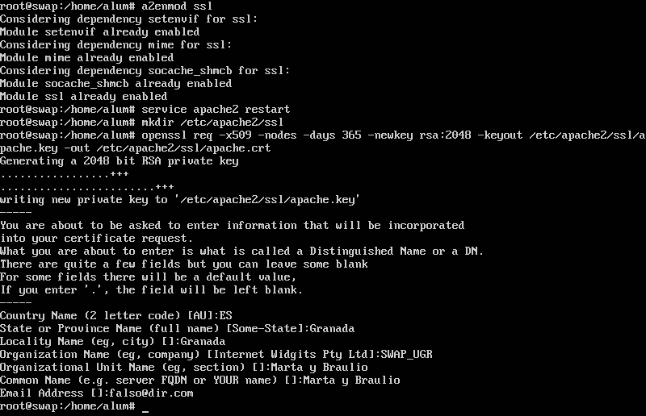

A continuación, tendremos que pasar a editar el archivo de configuración de nuestro servidor para añadir nuestro certificado e indicar que el sitio utiliza un certificado SSL. Para ello, usaremos el siguiente comando `sudo nano /etc/apache2/sites-avilable/default-ssl`, y añadimos las líneas:
```
SSLCertificateFile /etc/apache2/ssl/apache.crt
SSLCertificateKeyFile /etc/apache2/ssl/apache.key
```
tal y como se ve en la siguiente imagen.

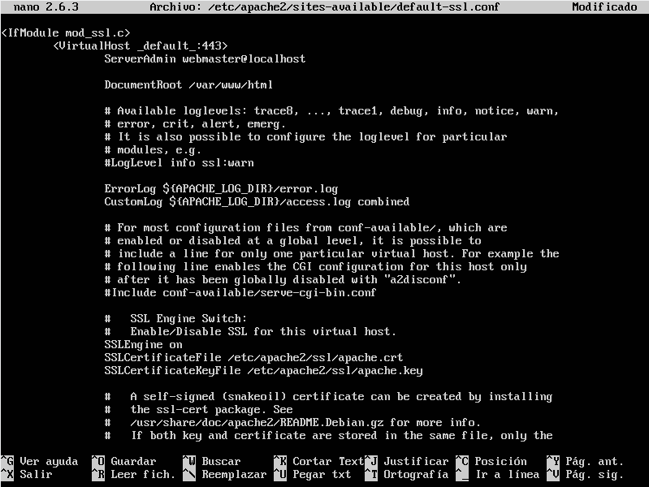

Una vez hecho esto, tenemos que activar el `default-ssl` con `a2ensite default-ssl` y reiniciar el servicio. 

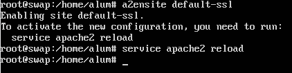

Para comprobar que funciona, accederemos a nuestro sitio web y veremos que el certificado está activo, pero como no está firmado por ninguna entidad de confianza sino que es autofirmado, Firefox nos dirá que el sitio no es seguro, como se ve en la siguiente imagen:

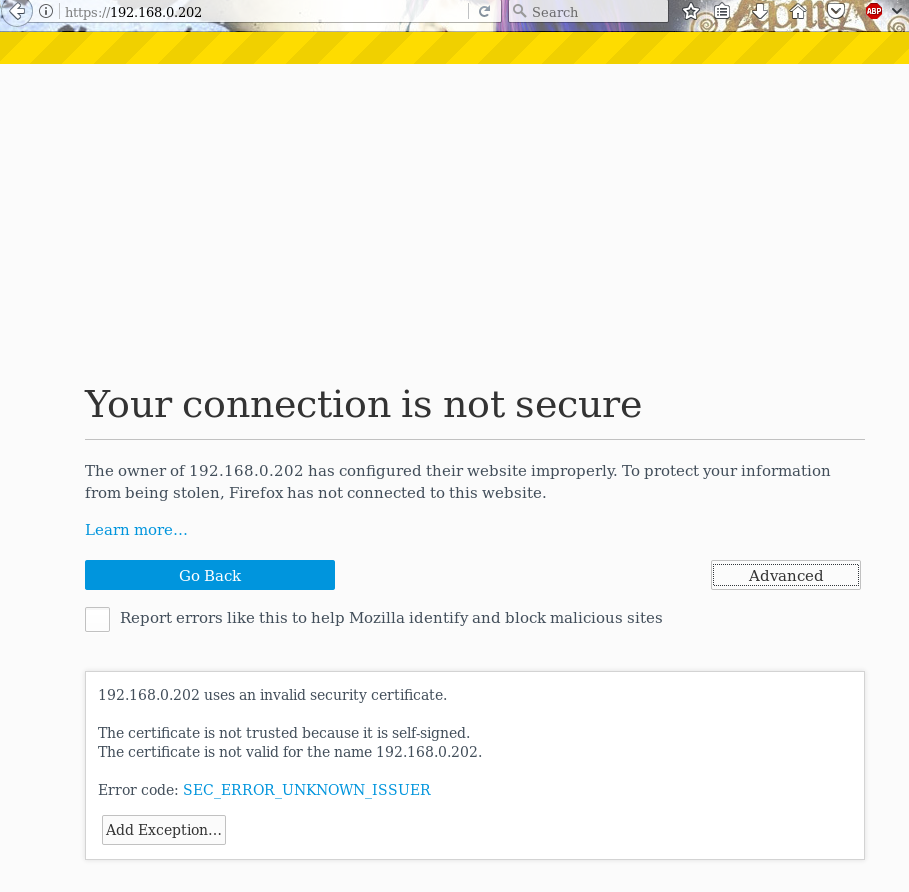

## Configuración del cortafuegos

Antes de empezar a configurar nuestro cortafuegos con `iptables`, primero veremos el estado del cortafuegos ejecutando la siguiente orden

```bash
$ iptables -L -n -v
```

La salida nos muestra el estado del cortafuegos antes de modificar nada, su estado inicial, como se ve en la siguiente imagen:

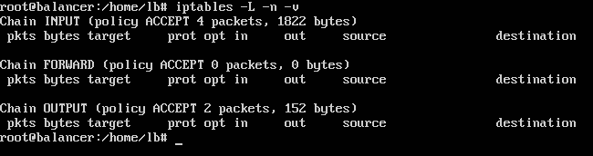

En la imagen podemos ver cómo no hay definida aún ninguna regla, por lo que se acepta todo el tráfico. Una vez comprobado esto, vamos a modificar el cortafuegos para que bloquee todo el tráfico y no acepte ninguno. Para ello, ejecutamos lo siguiente en nuestro terminal:

```bash
iptables -P INPUT DROP
iptables -P OUTPUT DROP
iptables -P FORWARD DROP
```

Una vez terminado, comprobamos el estado dle cortafuegos:

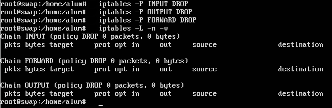

En el caso de bloquear el tráfico de entrada y permitir el de salida, ejecutamos lo siguiente: 

```bash
$ iptables -P INPUT DROP
$ iptables -P FORWARD DROP
$ iptables -P OUTPUT ACCEPT
$ iptables -A INPUT -m state --state NEW, ESTABLISHED -j ACCEPT 
```

Y mostramos el estado del cortafuegos:

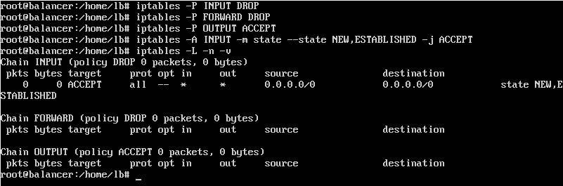

Además de esto, podemos bloquear también el tráfico ICMP para evitar ataques mediante `ping` con la siguiente orden:

```bash
$ iptables -A INPUT -p icmp --icmp-type echo-request -j DROP
```

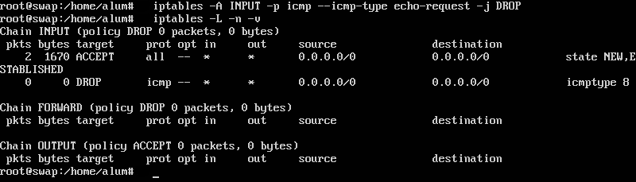

También podemos permitir el tráfico por SSH, si queremos administrar la máquina de forma remota, abriendo el puerto 22 de nuestro cortafuegos:

```bash
$ iptables -A INPUT -p tcp --dport22 -j ACCEPT
$ iptables -A OUTPUT -p udp --sport22 -j ACCEPT
```

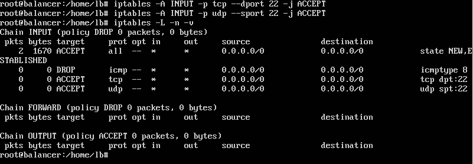

De igual forma, permitimos el tráfico HTTP y HTTPS abriendo el puerto 80 y 443 respectivamente para que nuestro servidor web pueda servir las páginas.

```bash
$ iptables -A INPUT -m state --state NEW -p tcp --dport 80 -j ACCEPT
$ iptables -A INPUT -m state --state NEW -p tcp --dport 443 -j ACCEPT
```

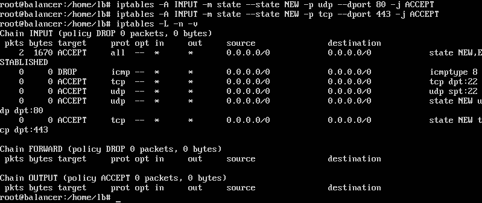

También podemos permitir el acceso DNS abriendo el puerto 53:

```bash
$ iptables -A INPUT -m state --state NEW -p udp --dport 53-j ACCEPT
$ iptables -A INPUT -m state --state NEW -p tcp --dport 53 -j ACCEPT
``` 

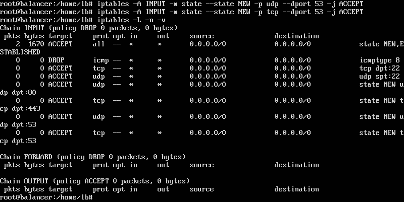

Y por último, para permitir todo el tráfico tanto de entrada como de salida hacia la máquina de administración, podemos introducir lo siguiente en nuestro shell para configurar el cortafuegos:

```bash
$ iptables -A INPUT -s 192.168.0.201 -j ACCEPT
$ iptables -A OUTPUT -s 192.168.0.201 -j ACCEPT
```

Finalmente, nuestro cortafuegos debe quedar como vemos en la siguiente imagen:

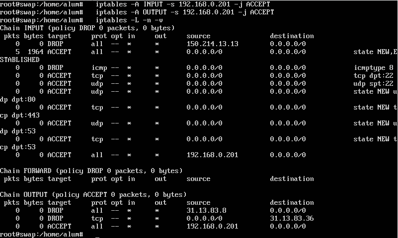

### Creación de una máquina cortafuegos

Esta máquina cortafuegos, será una nueva máquina $M_4$, que irá justo delante del balanceador de carga, que se encargará de filtrar todo el tráfico y pasarle sólo a la máquina balanceadore el tráfico HTTP y HTTPS. 

Una vez creada la máquina _firewall_, pasaremos a la configuración del firewall y del _enrutamiento de IPs_ (_IP forwarding_), que redirige el tráfico filtrado de la máquina firewall a la máquina balanceadora. Para configurar el firewall, usaremos `iptables` y el script desarrollado anteriormente para realizar una configuración automática.

Además de esto, tenemos que activar el parámetro del kernel `pv4.ip_forward` poniéndolo a 1 para que se pueda redireccionar el tráfico. Esto se puede hacer con la orden: 

```
sysctl -w net.ipv4.ip_forward=1
```

y para que cuando apaguemos la máquina se mantengan los cambios, en el fichero `/etc/sysctl.conf ` cambiamos el valor de la siguiente línea a 1: 
```
net.ipv4.ip_forward = 0
```
y para activar los cambios ejecutamos la siguiente orden:

```
 sysctl -p /etc/sysctl.conf 
```
