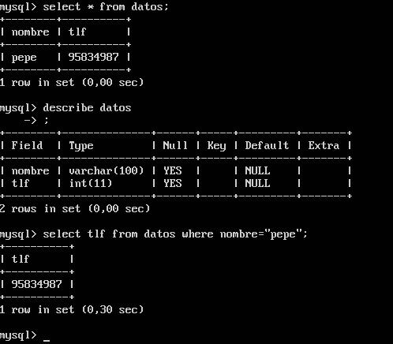

# Práctica 5: Replicación de bases de datos MySQL

## Creación de una base de datos e inserción de datos

Para crear nuestra base de datos (_BD_), tendremos que entrar en el terminal de _MySQL_. Para ello, ejecutamos la siguiente orden en nuestro terminal.

```{bash}
mysql -u root -p
``` 

Introducimos la contraseña y se iniciará el terminal de MySQL tal. Tras esto, crearemos una BD, junto con una tabla, tal y como se ve en la siguiente figura:


Además de esto, tendremos que insertar algún dato en la BD que acabamos de crear, para tener algo de lo que hacer copia de seguridad. En nuestro caso, insertaremos a _Pepe_ y su número de teléfono en la tabla.



Una vez terminada la inserción de datos, para poder hacer la copia de seguridad de forma correcta y que no surjan problemas porque alguien acceda a la BD mientras se está haciendo el volcado con `mysqldump`, tenemos que bloquear la BD. Para ello, volveremos a entrar en el terminal de MySQL y ejecutaremos la siguiente orden:

```
FLUSH TABLES WITH READ LOCK;
```

Con esto bloquearemos los accesos a la BD para poder hacer el volcado de forma correcta, ejecutando el comando `mysqldump contactos -u root -p > /tmp/ejemplodb.sql`.

Tras esto, nos pedirá la contraseña para poder realizar la operación y una vez introducida, se procederá al volcado de la BD. Una vez haya finalizado, tenemos que "desbloquear" las tablas para que se pueda volver a acceder a ellas. La orden `UNLOCK TABLES;` que se ejecuta en la consola de MySQL es la encargada de hacer esta tarea. 

Todo este proceso puede verse en la siguiente figura.


Una vez hecho esto, podemos pasar a copiar la BD en nuestra máquina secundaria usando el comando `scp`, tal y como se ve en la siguiente imagen:


Además de esto, es necesario crear en nuestra máquina esclavo la BD correspondiente para poder restaurar el _dump_. Esto lo podemos ver en la siguiente imagen:


