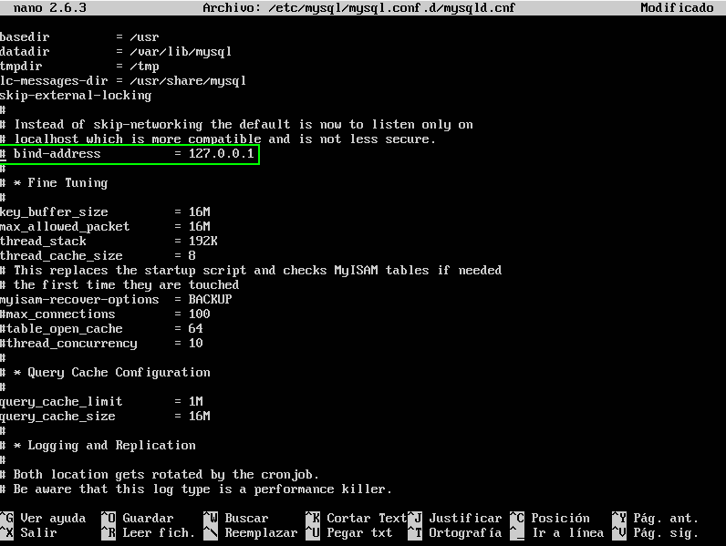
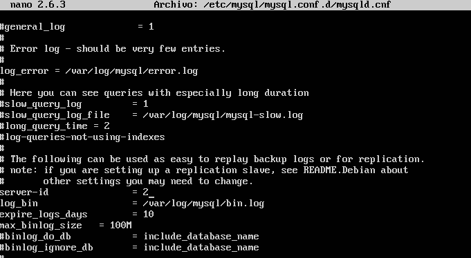
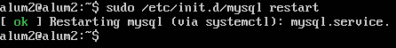
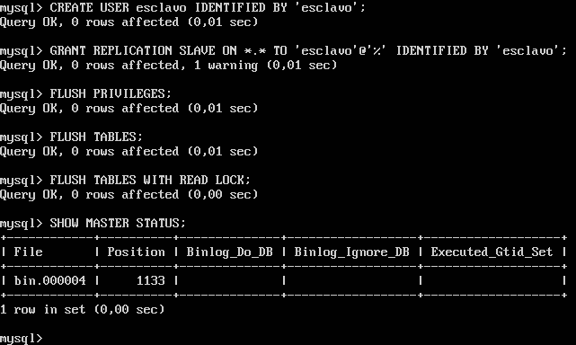
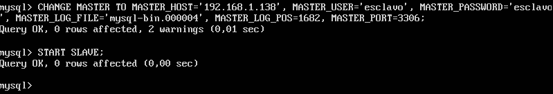
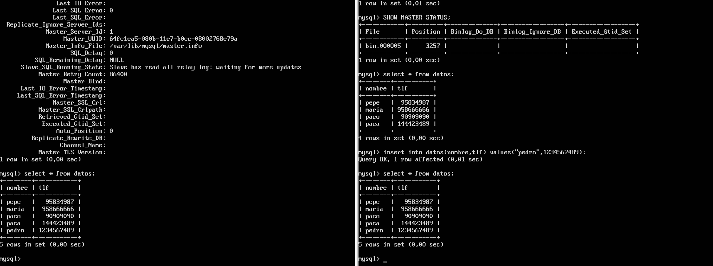

# Práctica 5: Replicación de bases de datos MySQL

## Creación de una base de datos e inserción de datos

Para crear nuestra base de datos (_BD_), tendremos que entrar en el terminal de _MySQL_. Para ello, ejecutamos la siguiente orden en nuestro terminal.

```{bash}
mysql -u root -p
``` 

Introducimos la contraseña y se iniciará el terminal de MySQL tal. Tras esto, crearemos una BD, junto con una tabla, tal y como se ve en la siguiente figura:


Además de esto, tendremos que insertar algún dato en la BD que acabamos de crear, para tener algo de lo que hacer copia de seguridad. En nuestro caso, insertaremos a _Pepe_ y su número de teléfono en la tabla.


## Replicar una BD MySQL con mysqldump

Una vez terminada la inserción de datos, para poder hacer la copia de seguridad de forma correcta y que no surjan problemas porque alguien acceda a la BD mientras se está haciendo el volcado con `mysqldump`, tenemos que bloquear la BD. Para ello, volveremos a entrar en el terminal de MySQL y ejecutaremos la siguiente orden:

```
FLUSH TABLES WITH READ LOCK;
```

Con esto bloquearemos los accesos a la BD para poder hacer el volcado de forma correcta, ejecutando el comando `mysqldump contactos -u root -p > /tmp/ejemplodb.sql`.

Tras esto, nos pedirá la contraseña para poder realizar la operación y una vez introducida, se procederá al volcado de la BD. Una vez haya finalizado, tenemos que "desbloquear" las tablas para que se pueda volver a acceder a ellas. La orden `UNLOCK TABLES;` que se ejecuta en la consola de MySQL es la encargada de hacer esta tarea. 

Todo este proceso puede verse en la siguiente figura.


Una vez hecho esto, podemos pasar a copiar la BD en nuestra máquina secundaria usando el comando `scp`, tal y como se ve en la siguiente imagen:


Además de esto, es necesario crear en nuestra máquina esclavo la BD correspondiente para poder restaurar el _dump_. Esto lo podemos ver en la siguiente imagen:


## Replicación de BD mediante una configuración maestro-esclavo

Para poder automatizar este proceso, podemos realizar una configuración __maestro-esclavo__ en MySQL. Así, al realizar un cambio en la base de datos del _maestro_, este se verá reflejado automáticamente en el _esclavo_. Para ello, debemos realizar los siguientes pasos:

1. Comentar la línea `bind-address` del fichero de configuración de MySQL. Al tener instalada la __versión 5.7__, dicho fichero es `/etc/mysql/mysql.conf/mysqld.cnf`:

    

2. Añadir a dicho fichero el `log_error`, el id del servidor y, por último, el `log_bin`:

    

3. Reiniciar el servicio de MySQL:

    

4. Hacemos la misma configuración en el _esclavo_, con la única diferencia de que el `server-id` debe ser igual a 2 en este caso:

    
    

5. Creamos un usuario en el maestro y le damos permiso para la replicación. Dicho usuario será `esclavo` y su contraseña será también `esclavo`.

    


6. Indicamos al esclavo los datos del maestro, y lo iniciamos. 

    

    Al hacer esta operación, obtenemos dos warning. Dichos warning se deben a que es inseguro pasar credenciales en texto plano.

    

7. Volvemos al maestro y desbloqueamos las tablas para poder introducir nuevos datos:

    

8. Por último, ejecutamos el comando `SHOW SLAVE STATUS\G` y comprobamos que la variable `Seconds_Behind_Master` sea distinta de `NULL`:

    

9. Con esto, ya habrá concluido la configuración maestro-esclavo. Si añadimos un dato al master, este cambio se verá reflejado en el esclavo:

    
    
## Configuración Maestro-Maestro

Basándonos en los pasos reflejados en el [tutorial de DigitalOcean](https://www.digitalocean.com/community/tutorials/how-to-set-up-mysql-master-master-replication), los pasos para hacer una configuración __maestro-maestro__ son:

En primer lugar, debemos modificar los archivos de configuración de ambos servidores y cambiar el parámetro `binlog_do_db` para compartir la base de datos de contactos que creamos previamente.


Una vez hecho eso, reiniciamos el servicio en ambos servidores.

Después, creamos un usuario `replicator` para que el otro servidor maestro pueda acceder a la base de datos.


A continuación, configuramos el otro servidor como maestro con el comando `CHANGE MASTER`. Es importante parar el esclavo previamente con `STOP SLAVE` y, después, volver a arrancarlo.


Por último, añadimos datos desde ambos maestros y comprobamos que la modificación se ve reflejada en el otro servidor:

