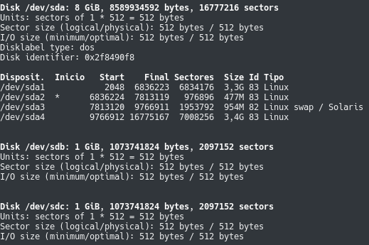

# Práctica 6 - Discos en RAID

## Añadiendo discos virtuales

Para añadir un disco virtual a una máquina virtual (_VirtualBox_), sólo hay que entrar en la configuración de la máquina y, en la pestaña de almacenamiento, hacer click en el botón señalado en azul. Esto nos abrirá un asistente que creará el disco virtual con el nombre y tamaño que digamos.

## Configuración del RAID por software
En primer lugar, debemos tener el paquete `mdadm` instalado.

Una vez instalado el paquete `mdadm`, debemos crear el RAID. Para ello, necesitamos saber la identificación asignada a los dos nuevos discos. Dicha identificación podemos obtenerla con el comando `sudo fdisk -l`:

Y ahora sí, creamos el RAID usando el dispositivo `/dev/md0`:

Una vez creado, le damos formato ext2, que es el que da `mkfs` por defecto:

A continuación, creamos el directorio en el que se montará el RAID y lo montamos:

Como se aprecia, ha sido montado correctamente.

Por último, comprobamos el estado del RAID:

Tal y como hemos hecho, el RAID tiene dos discos y ambos están funcionando correctamente.
