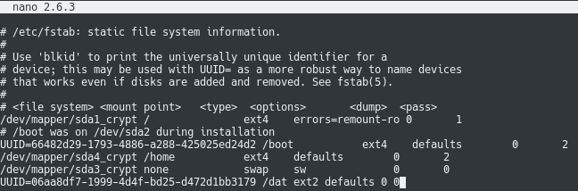
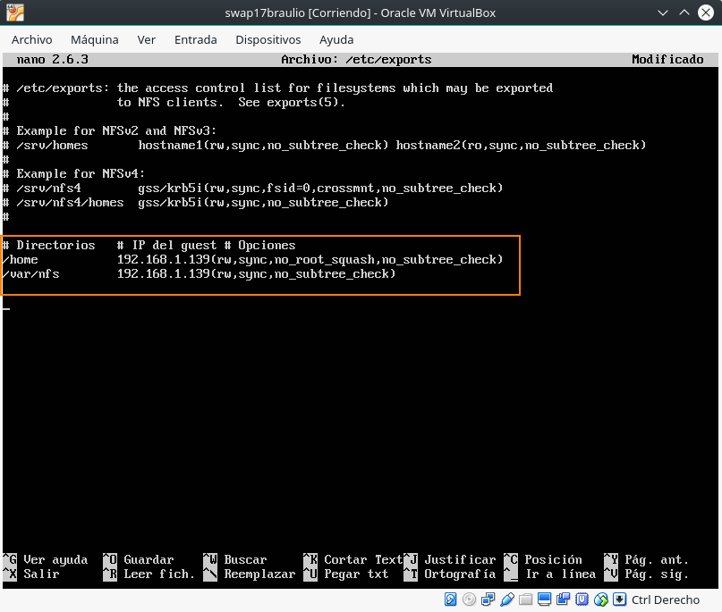
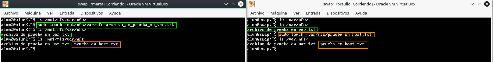
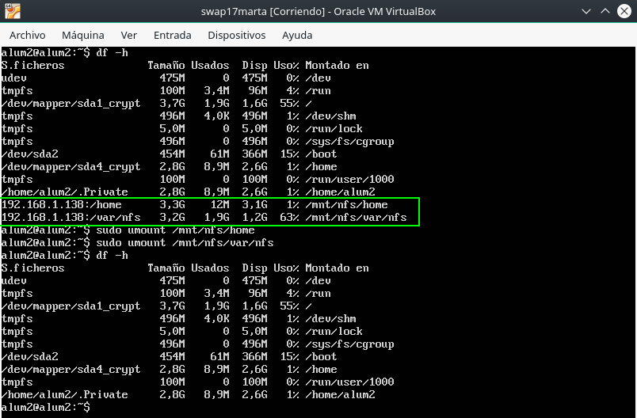

# Práctica 6 - Discos en RAID

## Añadiendo discos virtuales


Para añadir un disco virtual a una máquina virtual (_VirtualBox_), sólo hay que entrar en la configuración de la máquina y, en la pestaña de almacenamiento, hacer click en el botón señalado en azul. Esto nos abrirá un asistente que creará el disco virtual con el nombre y tamaño que digamos.

## Configuración del RAID por software
En primer lugar, debemos tener el paquete `mdadm` instalado.


Una vez instalado el paquete `mdadm`, debemos crear el RAID. Para ello, necesitamos saber la identificación asignada a los dos nuevos discos. Dicha identificación podemos obtenerla con el comando `sudo fdisk -l`:


En este caso, los identificadores asignados han sido __/dev/sdb__ y __/dev/sdc__.

Y ahora sí, creamos el RAID usando el dispositivo `/dev/md0`:


Una vez creado, le damos formato ext2, que es el que da `mkfs` por defecto:


A continuación, creamos el directorio en el que se montará el RAID y lo montamos:


Como se aprecia, ha sido montado correctamente.

Por último, comprobamos el estado del RAID:


Tal y como hemos hecho, el RAID tiene dos discos y ambos están funcionando correctamente.

## Automatizar el montaje del RAID al arrancar
Para no tener que montar el disco cada vez que arranquemos el sistema, debemos automatizar dicha tarea __añadiéndolo al fstab__.

Para ello, en primer lugar debemos obtener el _UUID_ del disco:


Una vez obtenido, lo añadimos a la última línea del fichero `/etc/fstab`:



Para comprobar que el proceso ha ido correctamente, reiniciamos el sistema y ejecutamos `sudo mount`:


El disco se ha montado automáticamente, pero ahora con el nombre `/dev/md127`.

## Simulando fallo en uno de los discos
Finalmente, vamos a comprobar que aunque falle uno de los discos podemos seguir accediendo a la carpeta `/dat`.

En primer lugar, simulamos un fallo en uno de los discos:


En la información sobre el estado del RAID, podemos ver cómo hay un disco caído y, además, incluso podemos saber cuál es (/dev/sdb).

Ahora, como sabemos cuál es el que ha fallado vamos a retirarlo en caliente:


Al retirarlo, podemos seguir accediendo al directorio `/dat`.

Finalmente, probamos a añadir el disco de nuevo:


Una vez añadido vemos que se está reconstruyendo y que podemos seguir accediendo al directorio `/dat`.

## Realizar una configuración NFS

Para realizar una configuración NFS, debemos establecer una máquina como la ___máquina host___, que será la que contenga originalmente los archivos, y una ___máquina anfitriona___ que será donde realizaremos la sincronización. Una vez decidido esto, pasaremos a hacer la configuración de la máquina anfitriona.

A continuación, vamos a realizar la configuración de las máquinas, siguiendo este tutorial de [DigitalOcean](https://www.digitalocean.com/community/tutorials/how-to-set-up-an-nfs-mount-on-ubuntu-14-04).

### Configuración del servidor anfitrión

En esta máquina, lo primero que debemos instalar es el paquete `nfs-kernel-server`, que será el que nos permita compartir nuestros directorios. Para ello, ejecutamos lo siguiente:

```{bash}
sudo apt install nfs-kernel-server
```

Al igual que en el tutorial, vamos a compartir dos carpetas con la otra máquina, que serán `/home` y `/var/nfs`. Como ya disponemos de un directorio `/home` en nuestra máquina, crearemos el directorio `/var/nfs`:

```{bash}
sudo mkdir /var/nfs
```

Una vez creado el directorio, es conveniente cambiar la propiedad del directorio al usuario `nobody` y asignarle el directorio al grupo `nogroup` para poder compartir el directorio. Sin embargo, esto no debemos hacerlo con el directorio `/home` para evitar problemas con los usuarios de la máquina o servidor _host_. Esta acción la haremos de la siguiente manera:

```{bash}
sudo chown nobody:nogroup /var/nfs
```


Una vez hecho esto, podemos pasar a configurar los ___NFS Exports___ en nuestro servidor _host_. Para ello, debemos abrir el fichero `/etc/exports`.

```{bash}
sudo nano /etc/exports
```

En este fichero, debemos añadir qué directorios son los que vamos a compartir, la dirección IP de la máquina con la que queremos compartirlo y las opciones de uso compartido de los distintos directorios. En nuestro caso, podemos ver en la siguiente imagen la configuración que aplicamos a los directorios.



Las opciones que hemos añadido significan:

* `rw`: el servidor que actúe como cliente, tendrá permisos de escritura y lectura en el directorio.
* `sync`: esta opción fuerza a NFS a escribir los cambios en disco antes de replicarlos, lo que nos proporciona estabilidad y consistencia en nuestras máquinas.
* `no_subtree_check`: Esta opción evita que el servidor _host_ compruebe que el fichero sigue existiendo en el directorio compartido para cada petición. Esto evita muchos problemas si a algún usuario se le ocurre renombrar el fichero mientras otro lo tiene abierto en el servidor cliente. En la mayoría de los casos, es lo mejor.
* `no_root_squash`: en este caso, deshabilitamos que NFS traduzca las peticiones de un usuario _root_ desde una máquina externa a un usuario sin privilegios en el servidor _host_. Esto se hace por seguridad, pero en este caso, como es un ejemplo didáctico, se desactiva.

Una vez terminado de configurar nuestro fichero, tendremos que crear la tabla NFS que refleje los directorios que queremos compartir. Esto se hace introduciendo el siguiente comando:

```{bash}
sudo exportfs -a
```

Tras esto, tendremos que iniciar el servicio NFS con la siguiente orden:

```{bash}
sudo service nfs-kernel-server start
```


### Configuración del servidor cliente

Para poder comenzar con la configuración en el lado del servidor cliente, en este caso tenemos que instalar el siguiente paquete:

```{bash}
sudo apt install nfs-common
```

Tras tener el paquete instalado, pasaremos a montar los directorios que nuestro servidor anfitrión quiere compartir con nosotros. Para ello, usaremos el directorio `/mnt` como punto de montaje de estos directorios. Además de esto, vamos a crear un nuevo directorio llamado `nfs` para tener mejor localizado nuestros directorios NFS. 

```{bash}
sudo mkdir -p /mnt/nfs/home /mnt/nfs/var/nfs
```


A continuación, vamos a montar los directorios que está compartiendo el servidor _host_ con el servidor cliente, usando la orden `mount`:

```
sudo mount $IP_HOST:/home /mnt/nfs/home
sudo mount $IP_HOST:/var/nfs /mnt/nfs/var/nfs
```

Una vez montados los directorios, podemos comprobar que se han montado bien, ejecutando una simple orden `ls`. En nuestro caso `IP_HOST` fue 192.168.1.138, así que la orden que introducimos quedó de la siguiente manera:


Como podemos ver, la orden se ha ejecutado bien, y se han montado de forma correcta los directorios. Pero, existe una forma más elegante de comprobar esto, y es usando la siguiente orden:

```{bash}
df -h
```


En la imagen, en las dos últimas líneas podemos ver cómo el sistema de ficheros montado es el que corresponde al sistema de ficheros del servidor _host_, el tamaño, el espacio usado, el disponible, etc. y dónde está montado el sistema de archivos. Por lo tanto, podemos ver que se han montado de forma correcta.

## Probando el NFS

Una vez configurado y montado el NFS, podemos probar fácilmente que funciona de forma correcta, creando un fichero en los directorios con la orden `touch` en cualquiera de las máquinas.

```
sudo touch /mnt/nfs/home/archivo_de_prueba_en_home.txt
```

En este caso, la prueba es para el directorio `/home` desde la máquina cliente y como podemos ver en la siguiente imagen, funciona.


Lo mismo sucede si lo ejecutamos desde la máquina _host_. 

```
sudo touch /mnt/nfs/var/nfs/archivo_de_prueba_en_var.txt
```



Y al igual que antes, se realiza la sincronización de forma correcta.

## Realizar el montado del NFS de forma automática al inicio

Para no tener que estar ejecutando todos los comandos anteriores cada vez que queramos sincronizar las máquinas, podemos hacer que las máquinas se sincronicen al iniciarlas de la siguiente manera.

Lo primero es abrir el fichero `/etc/fstab`, y añadir al final del fichero las siguientes líneas:

```
192.168.1.138:/home    /mnt/nfs/home   nfs auto,noatime,nolock,bg,nfsvers=4,intr,tcp,actimeo=1800 0 0
192.168.1.138:/var/nfs    /mnt/nfs/var/nfs   nfs auto,noatime,nolock,bg,nfsvers=4,sec=krb5p,intr,tcp,actimeo=1800 0 0
```

Para más opciones de configuración del `fstab`, podemos consultar siempre el _man_, pero, las que aparecen en la línea significan:

* `auto`: detecta y establece de forma automática el sistema de archivos (_ext2_, _ext4_, etc.).
* `noatime`: se refiere al _File timestamp maintainence_ aunque para sistemas NFS no afecta.
* `nolock`: a parte de mejorar el rendimiento, es necesario para que, cuando montemos algo en el directorio `/var`, el _Network Lock Manager_ bloqueará algunos archivos. Es por esto, y a que algunos servidores no soportan tampoco NLM, el porqué de no bloquear los archivos al usar NFS.
* `bg`: el montado se realizará en segundo plano, y en caso de que falle, no mostrará ningún error.
* `nfsvers`: versión del protocolo de NFS.
* `sec`: lista de "_security flavors_" que se usarán para acceder a un archivo.
* `intr`: se usa para la compatibilidad, aunque a paritr del kernel 2.6.25 se ignora.
* `tcp`: _sugar sintax_ para establecer directamente que se use el protocolo _tcp_.
* `actimeo`: tiempo que espera NFS para pedir al servidor información sobre los archivos.


## Desmontar un sistema NFS

Para realizar esta acción en nuestra máquina cliente, es tan sencillo como invocar a la orden `umount`:

```{bash}
sudo umount /mnt/nfs/home
sudo umount /mnt/nfs/var/nfs
# O para desmontarlo todo en una sola orden
sudo umount -R /mnt/nfs/
```

Tras desmontarlo, podemos volver a ejecutar el comando `df -h` para ver los sistemas de archivos que hay montados en la máquina cliente, tal y como se ve en la siguiente imagen.


