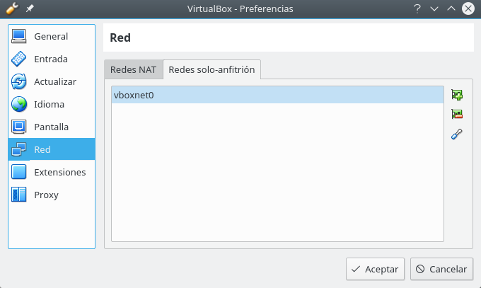
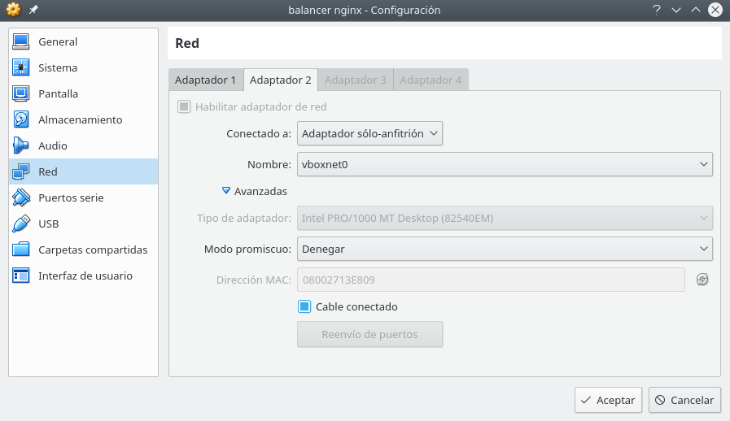

# Trabajar con máquinas virtuales en eduroam

Trabajar con máquinas virtuales en la red de eduroam de la UGR, puede resultar a veces problemático, ya que, debido a las limitaciones que ofrece la red, es probable el redireccionamiento IP de las máquinas y la conexión de red nos de más de un quebradero de cabeza.

Una de las posibles soluciones es usar, al menos en __VirtualBox__, una conexión ___Only-Host___ o ___Solo-Anfitrión___.

## Cómo configurar una conexión Only-Host

### Instalación de paquetes y módulos necesarios

Para empezar, tenemos que crear en VirtualBox una nueva red _Only-Host_. Pero antes de esto, debemos instalar en nuestra máquina anfitriona el paquete `net-tools` ya que el VBoxManage utiliza las órdenes `ifconfig` y `route` para asignar direcciones IP y encaminarlas a la interfaz del host.

```bash
$ pacaur -S net-tools        # Arch Linux y derivados
$ sudo apt install net-tools # Ubuntu y derivados
```

También, puede ser que nos falten módulos de VirtualBox por instalar, para poder realizar esta configuración de red. Estos módulos son:
    * `vboxdrv`
    * `vboxnetadp`
    * `vboxnetflt`
    * `vboxpci`
 
Estos módulos, si no están instalados, es necesario instalarlos. Una vez instalados, tenemos dos opciones, o bien cargarlos a mano antes de usar VirtualBox (no recomendable) con la orden `vboxreload`, y otra opción, es crear un pequeño archivo de configuración en el que indicamos qué módulos cargar durante el arranque del sistema.

Este fichero es `virtualbox.conf` y lo creamos:

```bash
$ sudo nano /etc/modules-load.d/virtualbox.conf
```
y en él insertamos lo siguiente:
```
vboxdrv         # módulo que necesita ser cargado antes
                # de ejecutar cualquier máquina virtual
vboxnetadp      # módulo para crear la interfaz del host
                # en las preferencias de virtualbox
vboxnetflt      # módulo necesario para cargar cualquier
                # máquina virtual que use only-host o bridge
vboxpci         # módulo necesario para ejecutar cualquier
                # máquina virtual que necesite pasar
                # a través de un dispositivo PCI en el host
```

### Configuración en VirtualBox

Una vez instalados todos los módulos y herramientas, podemos pasar a configurar la red y VirtualBox.

1. Acceder a la configuración de red en VirtualBox: `Archivo > Preferencias > Red >Red solo-anfitrión > Agrega red solo-anfitrión`.

2. Generar una nueva _red sólo-anfitrion_: cuando generemos una nueva red sólo-anfitrion, nos la generará como `vboxnet0`, como se puede ver en la siguiente imagen:



3. Configurar la red en las máquinas virtuales: una vez creada la red only-host, accedemos a la configuración de nuestra máquina virtual y añadimos un nuevo adaptador de red, que utilice la red only-host que acabamos de crear.

