# Kubernetes y computación cloud

### Marta Gómez Macías y Braulio Vargas López

# Docker y los contenedores.

Docker es un entorno virtualizado de ejecución de contenedores, agregando un sistema ligero de despliegue y ligero, que lo hace muy cómodo para la computación cloud.

## Qué es un contenedor

Un contenedor es, por decirlo de una manera, una simplificación de la virtualización clásica ya que un contenedor ofrece la capacidad de ofrecernos un sistema de ficheros completo, con un sistema operativo completo, capaz de alojar cualquier librería que seamos capaces de instalar, y lo más importante, nuestra aplicación; sin la necesidad de tener un hypervisor.


Además, ofrece una solución genial al problema de "esto en mi máquina funciona, no sé por qué en la tuya no", ya que el contenedor es independiente al hardware y software que haya instalado en la máquina anfitriona.

Los contenedores también tienen otras ventajas, como el que se ejecutan sobre el espacio de usuario sobre el kernel del SO, permite tener muchas instancias de esa misma máquina ejecutándose a la vez con una sobrecarga menor para la máquina que la que habría en el caso de hacerlo con máquinas virtuales.

## Imágenes docker
Las [__imágenes__](https://docs.docker.com/glossary/?term=image) son la base de los contenedores. Consisten en un sistema de archivos raíz con un determinado software instalado. Las imágenes no pueden cambiar una vez construidas. Son los [_contenedores_](https://docs.docker.com/glossary/?term=container) los que sí cambian. Un _contenedor_ es una instancia de una imagen.

Para construir una imagen se utilizan los denominados [__Dockerfiles__](https://www.digitalocean.com/community/tutorials/docker-explained-using-dockerfiles-to-automate-building-of-images). También hay [un repositorio](https://hub.docker.com/explore/) con imágenes listas para descargar.

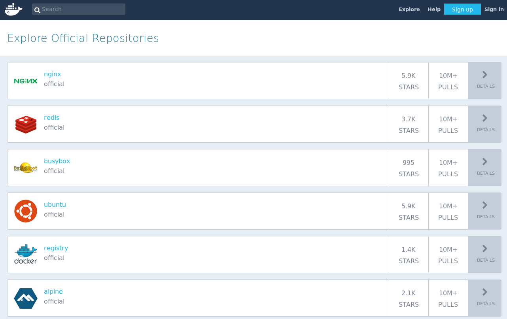

Otra cosa destacada de las imágenes es que pueden ser descargadas ([`docker pull`](https://docs.docker.com/engine/reference/commandline/pull/)) y subidas ([`docker push`](https://docs.docker.com/engine/reference/commandline/push/)) a un repositorio remoto. También pueden tener un control de versiones y etiquetas ([`docker tag`](https://docs.docker.com/engine/reference/commandline/tag/)), como un programa fuente subido a _Github_. Podemos ver las diferencias ([`docker diff`](https://docs.docker.com/engine/reference/commandline/diff/#examples)) entre distintos contenedores para ver cómo difieren de sus imágenes base.

### Capas en un contenedor


### Capas en una máquina virtual


Esto ofrece muchas ventajas, tanto durante la fase de desarrollo de una aplicación como en la de producción. En la fase de desarrollo, podemos usar los contenedores como máquinas de usar y tirar, ya que en ella instalas las librerías que necesitas, tu aplicación, y puedes probarla prácticamente de manera instantánea, y en caso de que esta máquina falle y muera, es tan sencillo como "tirarla a la basura" y ejecutar una nueva.

También se puede modificar estos contenedores modificando el archivo _Dockerfile_ donde podemos definir con unas sencilla reglas, qué hará el contenedor, pudiendo definir contenedores con _Nginx_ y _php_, _Apache_, etc.

# Clustering de contenedores: Docker Swarm y Kubernetes

## Docker Swarm

Docker Swarm es una herramienta hecha por y para hacer clusters de contenedores Docker, usando la misma API que Docker y que funciona directamente con este tipo de contenedores. Esto ofrece las ventajas de trabajar con la misma API que Docker, no que nos permite trabajar de forma muy rápida y cómoda, ya que no hay que adaptarse a un nuevo entorno, pero, tiene las mismas desventajas que tiene Docker.

Docker y su API hay ciertas cosas que no soporta, y en caso de que la API no soporte algo, ese algo no podrá ser instalado en todo nuestro cluster.

## Kubernetes  

Como podemos encontrar en su [página web](kubernetes.io), Kubernetes es un sistema para el despliegue automático de aplicaciones contenerizadas, generalmente mediante Docker. Esto se conoce como el orquestador de contenedores. Pero, ¿por qué no usar directamente contenedores Docker? 

1.  Docker no es capaz de ver nada más hayá del host que ejecuta el contenedor. 
2.  Si tenemos varios contenedores, estos no pueden ser vistos como una sola unidad.
3.  Por sí mismo, Docker no es capaz de de manejar y desplegar una gran cantidad de aplicaciones.

Para eso viene al rescate Kubernetes.  Aunque antes de empezar con él, debemos entender un poco la terminología que usa:

### Kubernetes Node (antiguos minions)


# Usando OpenShift para crear y subir aplicaciones

## ¿Qué es OpenShift?
Actualmente, hay varios tipos de servicios cloud:

* [_Software as a service_](https://www.salesforce.com/saas/): en vez de ofrecer un software que tiene que ser instalado en el cliente, se ofrece una aplicación web. El cliente sólo necesita un navegador para poder usar el software. Ejemplos: correo electrónico web, calculadora online, juegos javascript, etc. 
* [_Infrastructure as a service_](http://www.fujitsu.com/us/services/infrastructure/iaas/): ofrece recursos computaciones (almacenamiento, procesamiento, redes, etc). El cliente contrata los recursos que necesita y se le ofrecen como entornos virtualizados (contenedores) en los cuales puede instalar y ejecutar el software que quiera. Ejemplos: Amazon Web Services, Digital Ocean, Google Cloud Services....
* [_Platform as a service_](https://azure.microsoft.com/en-us/overview/what-is-paas/): al igual que el IaaS, se ofrece al cliente una máquina con unas determinadas prestaciones y se paga por uso. Además de ofrecer esto, el PaaS también ofrece software y herramientas de desarrollo para que el programador sólo se preocupe del desarrollo de su aplicación y se olvide de tener que estar pagando licencias, actualizando software, etc. Ejemplos: Microsoft Azure, OpenShift, Heroku...

__OpenShift__ se encuentra dentro del _PaaS_. Esto permite al usuario abstraerse del sistema operativo y el hardware subyacente, centrándose únicamente en desarrollar su aplicación. Además, _OpenShift_ tiene soporte para los framework web más populares (Django, Node.js, Ruby on Rails...) y, al ser software libre, podemos extenderlo y añadir soporte a cualquier otro. 

_OpenShift_ ha sido desarrollado por __Red Hat__ y se basa en ofrecer contenedores __Kubernetes__ con el software que elijamos (django, ruby on rails, etc). Como veremos a continuación, es muy sencillo desplegar aplicaciones en la nube.

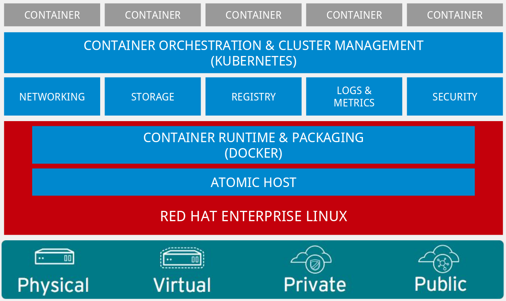

## Creando nuestra primera aplicación
En OpenShift nos ofrecen un [tutorial](https://docs.openshift.com/online/getting_started/basic_walkthrough.html#getting-started-basic-walkthrough) para familiarizarnos con su herramienta. Vamos a seguirlo y a analizar el resultado.

1. En primer lugar, debemos hacer un fork del repositorio  a nuestra cuenta personal de github y clonarlo en nuestro ordenador.

2. Una vez tenemos el repositorio clonado, creamos un nuevo proyecto en la consola web de OpenShift.

    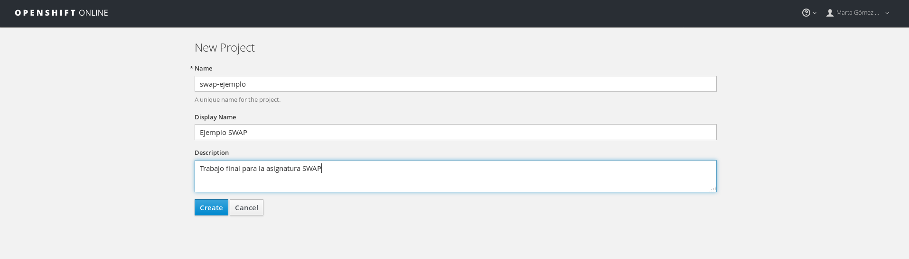

3. OpenShift nos ofrece varias opciones, según la herramienta con la que hayamos desarrollado nuestro proyecto. En nuestro caso, elegimos __Javascript__.

    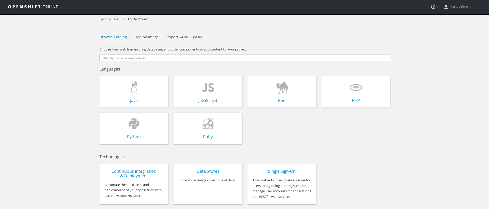

4. Seleccionamos la plantilla __Node.js + MongoDB__:

    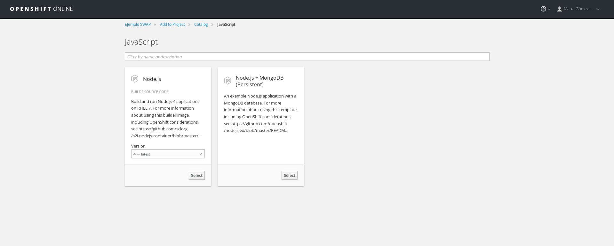

5. En la siguiente pantalla, sólo debemos cambiar la URL de Github por la de nuestro propio fork:

    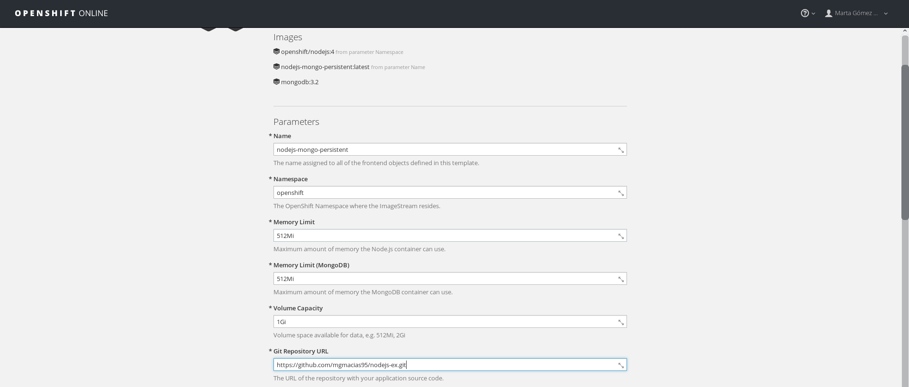

6. Una vez creada nuestra aplicación, tenemos varias opciones:
    * Usar la herramienta de consola `oc` para trabajar.
    * Usar la consola web de OpenShift

    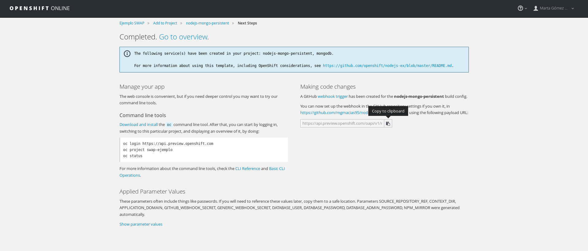

### Sincronizando Github y OpenShift
Si queremos que cada cambio que subamos a github se sincronice automáticamente con OpenShift, debemos configurar un [_Webhook_](https://developer.github.com/webhooks/). Para ello debemos:

1. Copiar la URL de nuestro _Webhook_. Tenemos varias opciones:
    * Copiarla de la sección _Making Code Changes_ de la pantalla _Next Steps_.
    * Copiarla de la consola web de OpenShift:
        
        a. Accede a los _Builds_ de tu proyecto y haz click sobre uno de ellos
        
        

        b. En la pestaña _Configuration_ se encuentra la URL de nuestro _Webhook_

        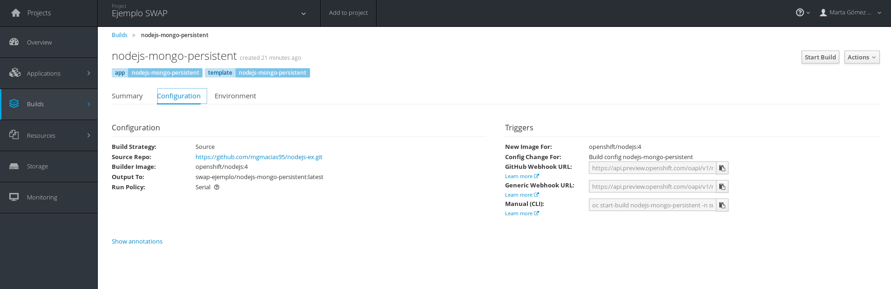

2. En la pestaña _Settings_ de nuestro proyecto de Github, acceder a _Webhooks & Services_ y copiar la URL en el campo __Payload URL__.

    


### Usando la herramienta `oc`
La herramienta para línea de comandos de _OpenShift_ es muy sencilla de usar: basta con descargar el ejecutable que nos dan en su página web comprimido en `tar.gz` y extraerlo:

```bash
$ tar -xf ~/Downloads/oc-3.4.1.2-1-linux.tar.gz
```


Una vez extraído, tendremos un archivo ejecutable llamado `oc`


## Análisis de la interfaz de OpenShift

La interfaz web de _OpenShift_ es bastante sencilla. Tiene seis submenús básicos:

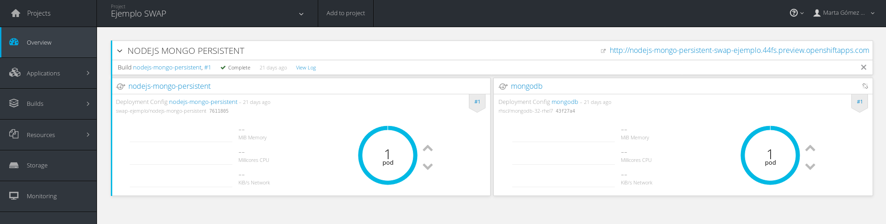

Cada uno de estos nos permite controlar las distintas versiones (builds) de nuestra aplicación, los distintos [pods](https://docs.openshift.org/latest/architecture/core_concepts/pods_and_services.html) y aplicaciones que tengamos (esto tiene más sentido para una versión que permita tener más de un servicio a la vez), los recursos que tenemos disponibles y los que estamos usando etc.

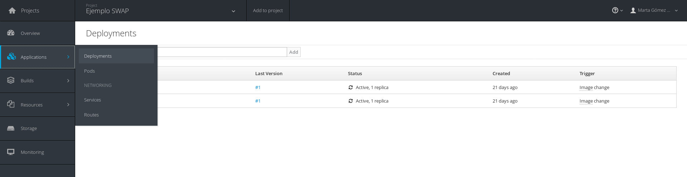
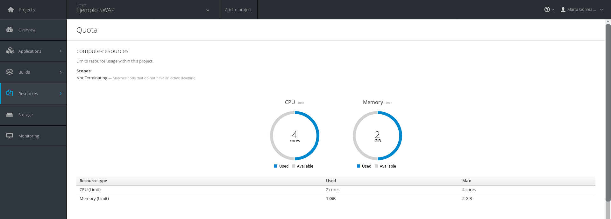
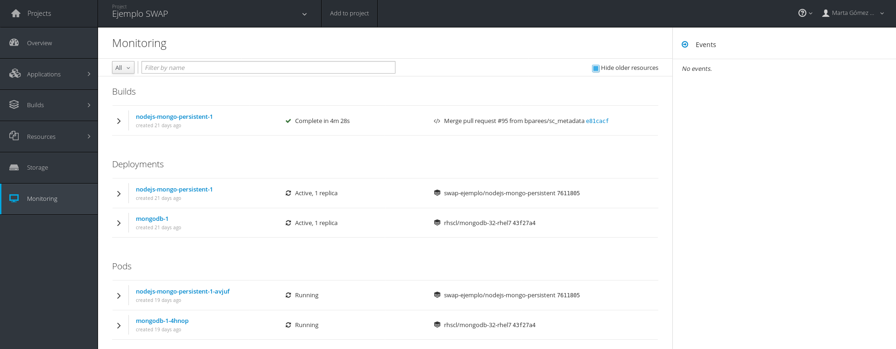
