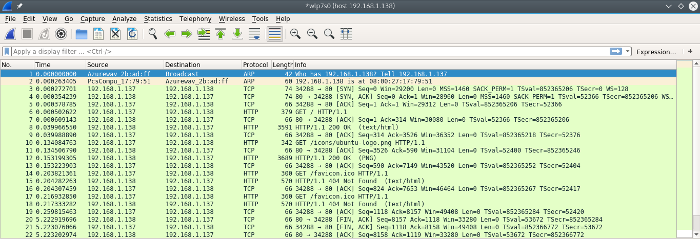

# Tema 5 - Medir prestaciones

__1. Buscar información sobre cómo calcular el número de conexiones por segundo. Para empezar, podéis revisr las siguientes webs  http://bit.ly/1ye4yHz y http://bit.ly/1PkZbLJ__.

En el caso de `nginx` esto es muy fácil de hacer ya que trae un módulo que se encarga de realizar estadísticas sobre las conexiones a nuestra máquina.

Para ello, tendremos que añadir a nuestro fichero de configuración `nginx.conf` lo siguiente:

```
location /nginx_status {
	# Turn on stats
	stub_status on;
	access_log   off;
	# only allow access from 192.168.1.5 #
	allow 192.168.1.5;
	deny all;
}
```

Tras esto, reiniciamos el servicio y accedemos a la siguiente url: `http://direccion_ip_del_sitio/nginx_status` y nos indicará el número de conexiones abiertas, el número de conexiones aceptadas, las que ha manejado y las conexiones que está manejando.

En caso de que nuestro sitio no utilice `nginx`, siempre estará a nuestra mano la herramienta `netstat`. Con `netstat` podemos obtener todas las conexiones que se realicen por http, al puerto 80, etc. Combinando la orden con un cauce y la herramienta `grep`.

```bash
# Para obtener todas las conexiones http
$ netstat | grep -c http | wc -l 
# Obtener todas las conexiones activas al servidor
$ netstat -na
# Obtener todas las conexiones activas al puerto 80
# y además ordenadas
$ netstat | grep :80 | sort
```

Apache también ofrece un módulo llamado `mod_status` que nos ofrece estadísticas sobre el servidor. Para activarlo, añadimos al `httpd.conf` lo siguiente:

```
<Location /server-status>
SetHandler server-status

Order Deny,Allow
Deny from all
Allow from .foo.com
</Location>
```

---

__2. Revisar los análisis de tráfico que se ofrecen en:__ http://bit.ly/1g0dkKj.
__Instalar wireshark y observar cómo fluye el tráfico de red en uno de los servidores web mientras se le hacen peticiones HTTP.__

En la siguiente imagen vemos el tráfico capturado por _Wireshark_ tras pedir el `index.html` a uno de los servidores apache de las prácticas:



Para realizar la captura, he filtrado por la IP del servidor (`192.168.1.138`). En la captura, se puede ver cómo se usa en primer lugar el protocolo __ARP__ donde mi ordenador (`192.168.1.137` ) pregunta quién es el ordenador con IP `192.168.1.138`. Una vez identificado, se pasa al ___threeway handshake___ usando el protocolo TCP. Y después, se pasa a servir el `index.html` usando HTTP. Por último, se cierra la conexión usando el flag `FIN` de TCP.

---

__3. Buscar información sobre características, disponibilidad para diversos SO, etc de herramientas para monitorizar las prestaciones de un servidor.__
__Para empezar, podemos comenzar utilizando las clásicas de Linux:__
 * ___top___.
 * ___vmstat___.
 * ___netstat___.

* `top`: esta herramienta nos ofrece un monitor en tiempo real sobre las características del sistema. La pantalla que muestra por defecto al ejecutar la orden es un monitor general del estado de nuestra máquina. En función de los parámetros que introduzcamos, podemos cambiar la pantalla de monitorización de `top`. Estos comandos los podemos ver ejecutando `man top` o bien acceder a https://linux.die.net/man/1/top.

* `vmstat`: _vmstat_ (_virtual memory statistics_) nos ofrece información sobre los procesos en ejecución, del estado de la memoria, paginación, etc. dependiendo de la opción que introduzcamos. Estas opciones, al igual que antes están disponibles en el man o en https://linux.die.net/man/8/vmstat.

* `netstat`: _netstat_ imprime información sobre conexiones de red, tablas de enrutamiento, estadísticas sobre interfaces de red, etc. Tal y como se indica en [netstat(8)](https://linux.die.net/man/8/netstat), este programa está obsoleto y ha sido reemplado por `ss`; `netstat -r` ha sido reemplazado por `ip route`, `netstat -i`, ha sido reemplazado por `ip -s link` y `netstat -g` ha sido reemplazado por `ip maddr`.

En [Windows](https://docs.microsoft.com/en-us/sql/relational-databases/performance/performance-monitoring-and-tuning-tools#windows-monitoring-tools) tenemos, de forma nativa, dos herramientas de monitorización:

* _Task Manager_: muestra las aplicaciones y procesos que se están ejecutando en el sistema con información tal como el proceso padre o la cantidad de memoria que consumen.

* _Network Monitor Agent_: monitoriza el tráfico de red.
