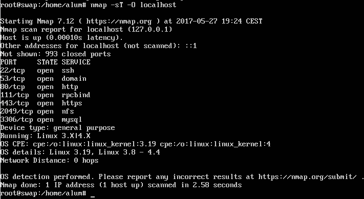

# Tema 6 - Asegurar el sistema web

__1. Aplicar con *iptables* una política de denegar todo el tráfico en una de las máquinas de prácticas. Comprobar el funcionamiento.__

Para denegar todo el tráfico, tenemos que ejecutar los siguientes comandos:

```
# iptables -F
# iptables -P INPUT DROP
# iptables -P OUTPUT DROP
# iptables -P FORWARD DROP
```

Al intentar obtener la página `index.html` que tenemos en el servidor apache, `curl` se quedará intentando conectarse al servidor hasta que expire el tiempo de conexión:

```
[marta@vaio tema6]$ curl 192.168.1.138
curl: (7) Failed to connect to 192.168.1.138 port 80: Expiró el tiempo de conexión
```

__Aplicar con *iptables* una política de permitir todo el tráfico en una de las máquinas de prácticas. Comprobar el funcionamiento.__

Para permitir todo el tráfico, ejecutamos el siguiente comando:

```
# iptables -P INPUT ACCEPT
# iptables -P OUTPUT ACCEPT
# iptables -P FORWARD ACCEPT
```

Al volver a ejecutar el comando `curl`, obtenemos el `index.html` al instante.

---

__2. Comprobar qué puertos tienen abiertos nuestras máquinas, su estado y qué programa o demonio los ocupa.__



En el caso de uno de los servidores de prácticas, los puertos abiertos son: el 22 con SSH, el 53 con domain, el 80 con HTTP, el 111 con rpcbind, el 443 con HTTPS, el 2049 con NFS y el 3306 con MySQL.

---

__3. Buscar información acerca de los tipos de ataques más comunes en servidores (p. ej. secuestros de sesión). Detallar en qué consisten, y cómo se pueden evitar.__

Además de los ataques mencionados en el tema 6 de teoría, algunos de los más populares son:

* [__Secuestro de sesión__](https://en.wikipedia.org/wiki/Session_hijacking): consiste en entrar de forma no autorizada a un información o servicios de un sistema informático. Este acceso se hace robando la _cookie mágica_ que se usa para autenticar a un usuario en un servidor remoto. En el desarrollo web, las cookies se utilizan para mantener la sesión del usuario y dichas cookies pueden ser robadas con facilidad por un atacante. Así, si nos identificamos en una web y alguien nos roba la cookie HTTP, podrá identificarse en dicha web sin necesidad de introducir nuestro usuario y contraseña. Hay más tipos de secuestros informáticos detallados en [Wikipedia](https://es.wikipedia.org/wiki/Hijacking).

* [__Inyección SQL__](https://es.wikipedia.org/wiki/Inyecci%C3%B3n_SQL): consiste en introducir código SQL maligno dentro del código SQL programado, para alterar el funcionamiento normal de un programa o aplicación y lograr así que se ejecute dicho código invasor en la base de datos. Dicho código malicioso podrá insertar registros, modificar o eliminar datos, autorizar accesos e incluso ejecutar otro tipo de código malicioso en el ordenador.

* [__Man-in-the-middle__](https://en.wikipedia.org/wiki/Man-in-the-middle_attack): el atacante se coloca entre una comunicación entre dos finales. Puede o bien simplemente escuchar la comunicación entre ambos o, incluso, modificarla. Muchos protocolos, como SSH, realizan pruebas de integridad en las comunicaciones para asegurarse de que nadie las está escuchando o modificando. Braulio y yo hicimos un [trabajo](https://github.com/mgmacias95/SSH-El-Ataque-MITM) sobre este ataque en SSH para la asignatura _Ingeniería de Servidores_.

* [__DNS Amplification Attack__](https://www.us-cert.gov/ncas/alerts/TA13-088A): es una forma muy popular del ataque DDoS que se basa en el uso de los DNS públicamente accesibles para saturar a la víctima con tráfico DNS.
